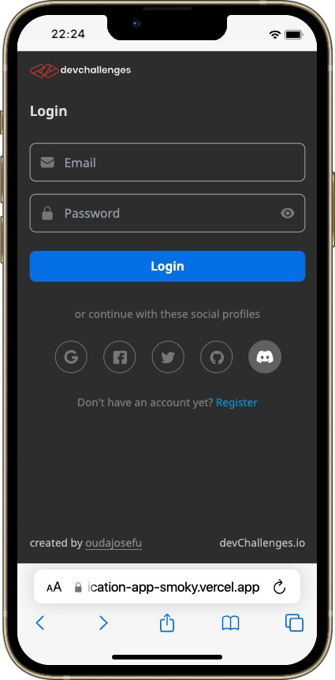
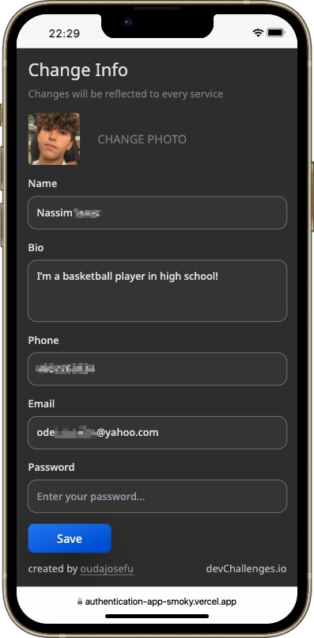
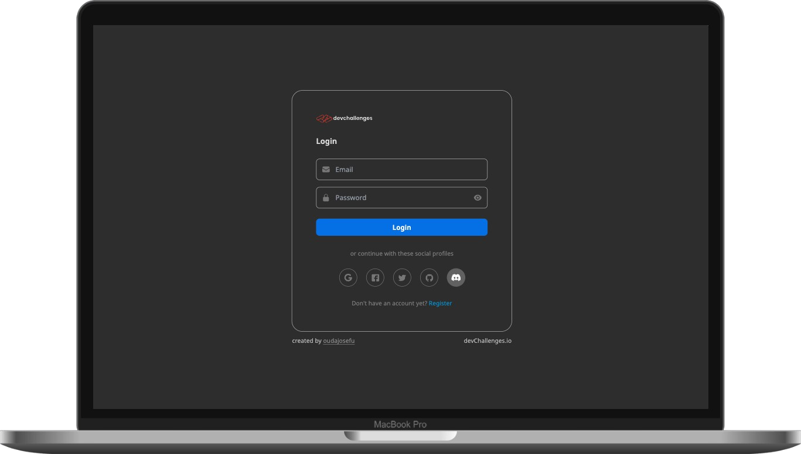
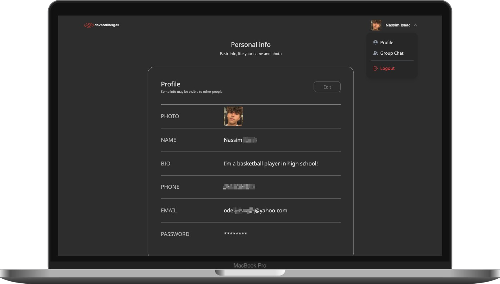
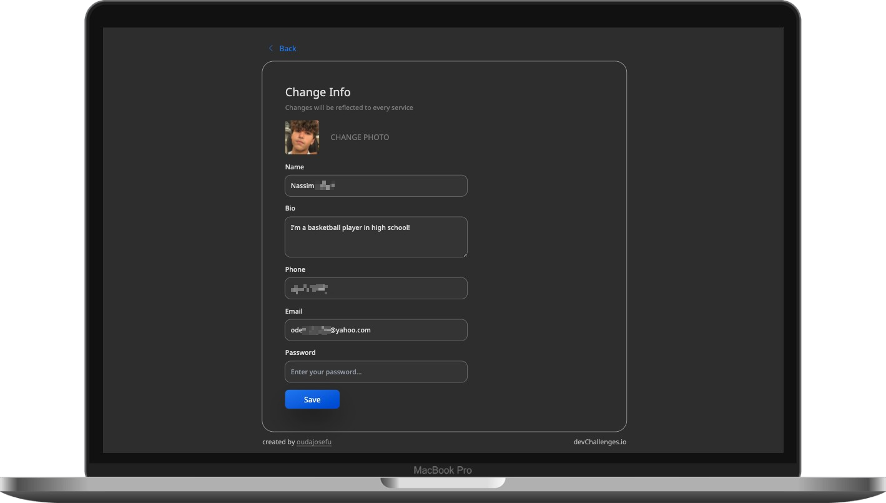

<!-- Please update value in the {}  -->

<h1 align="center">Authentication App</h1>

   Solution for a challenge from  <a href="http://devchallenges.io" target="_blank">Devchallenges.io</a>.

  <h3>
    <a href="https://authentication-app-smoky.vercel.app/">
      Demo
    </a>
     | 
    <a href="https://github.com/oudajosefu/AuthenticationApp">
      Solution
    </a>
     | 
    <a href="https://devchallenges.io/challenges/N1fvBjQfhlkctmwj1tnw">
      Challenge
    </a>
  </h3>

<!-- TABLE OF CONTENTS -->

## Table of Contents

- [Overview](#overview)
  - [Built With](#built-with)
- [Features](#features)
- [How to use](#how-to-use)
- [Contact](#contact)
- [Acknowledgements](#acknowledgements)

<!-- OVERVIEW -->

## Overview

- What was your experience?
  - This was a very challenging app as I was a completely new to the authentication process. Hence, it proved to be a great learning process and really set a foundation for auth handling in future projects.
  - I used the [T3 Stack](https://create.t3.gg/) which uses NextAuth along with tRPC for a type-safe backend to create a great developer experience while working with the difficult aspects of authentication.
    - Because I used this stack, I was able to follow Nexxel's fantastic [blog post](https://www.nexxel.dev/blog/ct3a-guestbook) detailing the beginning process for setting up the stack, connecting it to a database, and configuring its first social provider.
  - The email and password login method was especially challenging to set up due to NextAuth not handling credentials the way the Figma design intended. I will have to go back and change it to only use the built-in email login method since it is currently not working as is.
  - The social providers are all working for the most part. I will have to publish the app on each social provider's auth dashboard to allow anyone to check out the project.
- What have you learned/improved?
  - I learned a lot about authentication and how to set up a NextAuth project. I also learned how to use the T3 Stack and how to connect it to a database.
  - I improved my skills with Next.js, React, and TypeScript.
- Your wisdom? :)
  - I would recommend using the T3 Stack for any project that requires authentication. It is a great way to get started with authentication and it is very easy to use.

### Built With

<!-- This section should list any major frameworks that you built your project using. Here are a few examples.-->

- [T3 Stack](https://create.t3.gg/)
  - [Next.js](https://nextjs.org/)
  - [React](https://reactjs.org/)
  - [Tailwind](https://tailwindcss.com/)
  - [TypeScript](https://www.typescriptlang.org/)
  - [NextAuth](https://next-auth.js.org/)
  - [tRPC](https://trpc.io/)
  - [Prisma](https://www.prisma.io/)
- [Vercel](https://vercel.com/)
- [Figma](https://www.figma.com/)
- [Railway](https://railway.app/)
  - [PostgreSQL](https://www.postgresql.org/)

This application/site was created as a submission to a [DevChallenges](https://devchallenges.io/challenges) challenge. The [challenge](https://devchallenges.io/challenges/N1fvBjQfhlkctmwj1tnw) was to build an application to complete the given user stories.

## Contact

- GitHub [@oudajosefu](https://github.com/oudajosefu)
- Twitter [@oudajosefu](https://twitter.com/oudajosefu)
